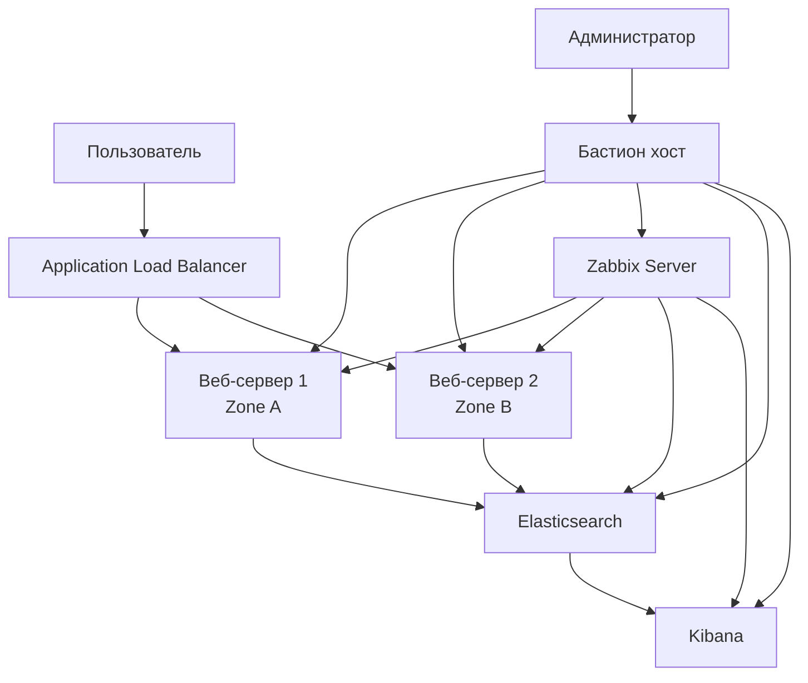

# Анализ репозитория инфраструктуры Yandex Cloud

## Обзор проекта
Проект представляет собой инфраструктуру для дипломной работы, разворачиваемую в Yandex Cloud с использованием:
- **Terraform** для создания облачных ресурсов
- **Ansible** для конфигурации виртуальных машин
- **Nginx** как веб-сервер
- **ELK Stack** для логирования
- **Zabbix** для мониторинга
- **Bastion host** для безопасного доступа

## Архитектурная схема



## Критические ошибки и проблемы

### 1. **Ошибки компиляции Terraform** (БЛОКИРУЮЩИЕ)
- **`local.vm_fqdn` не определен** - используется в `zabbix.tf`, `elk.tf` (строки 4, 51)
- **`var.private_app_subnet_cidrs` не определен** - используется в `vpc.tf` (строка 22)
- **`local.web_server_zones` не определен** - используется в `outputs.tf` (строка 38)
- **Синтаксическая ошибка в `zabbix.tf`** - строка 1: ` Zabbix Server` (лишний пробел)

### 2. **Проблемы безопасности** (ВЫСОКИЙ ПРИОРИТЕТ)
- **SSH доступ к bastion со всего интернета** - `0.0.0.0/0` на порт 22
- **Zabbix и Kibana доступны публично** - без аутентификации
- **Отсутствие HTTPS** для веб-сервисов
- **Слабые настройки безопасности web-серверов** - открыт порт 80 для всех

### 3. **Ошибки в HTML файле** (СРЕДНИЙ ПРИОРИТЕТ)
- **Некорректный синтаксис HTML** в `ansible/files/nginx/index.html`:
  - Незакрытые теги: `<title>`, `<h1>`, `<strong>`, `<div>`
  - Неправильные атрибуты Jinja2: `{{ zone | default('Не указана') }}`
  - Отсутствует закрытие тегов в строках 4, 46, 47, 50, 52, 54, 58

### 4. **Проблемы с Ansible** (СРЕДНИЙ ПРИОРИТЕТ)
- **Хардкод путей в `update-inventory.sh`** - `cd ~/yandex-diploma/terraform`
- **Отсутствует обработка ошибок** в скрипте обновления инвентаря
- **Нет динамического inventory** для Terraform
- **Дублирование NAT Gateway** в security groups (определен дважды)

### 5. **Архитектурные недостатки** (НИЗКИЙ ПРИОРИТЕТ)
- **Single point of failure** для ALB (только одна зона)
- **Нет автоматического масштабирования** web-серверов
- **Отсутствие backup стратегии** для данных Elasticsearch
- **Нет health checks** для некоторых сервисов

## Подробные рекомендации по исправлению

### Высокий приоритет (исправить немедленно)

#### 1. Исправить undefined Terraform функции
```hcl
# В locals.tf добавить:
locals {
  # ... существующий код ...
  
  vm_fqdn = function(name) {
    "${name}.${var.environment}.internal"
  }
  
  web_server_zones = ["ru-central1-a", "ru-central1-b"]
}

# В variables.tf добавить:
variable "private_app_subnet_cidrs" {
  description = "CIDR blocks for private app subnets per zone"
  type = map(string)
  default = {
    "ru-central1-a" = "10.0.2.0/24"
    "ru-central1-b" = "10.0.3.0/24"
  }
}
```

#### 2. Улучшить безопасность bastion
```hcl
# В security_groups.tf изменить:
ingress {
  protocol       = "TCP"
  description    = "SSH access from restricted IPs"
  v4_cidr_blocks = ["ВАШ_IP/32", "КОРПОРАТИВНЫЙ_IP_RANGE"]
  port           = 6022  # Измененный порт из cloud-init
}
```

#### 3. Исправить HTML файл
```html
<!DOCTYPE html>
<html>
<head>
    <title>Дипломный проект - Yandex Cloud</title>
    <style>
        /* Корректный CSS */
    </style>
</head>
<body>
    <div class="container">
        <h1>🎓 Дипломный проект</h1>
        <p>Отказоустойчивая инфраструктура в Yandex Cloud</p>
        <!-- Корректные теги -->
    </div>
</body>
</html>
```

### Средний приоритет (исправить в ближайшее время)

#### 1. Реализовать динамический inventory для Ansible
```bash
#!/bin/bash
# Использовать terraform output -json для генерации inventory
terraform output -json | jq -r '
  .web_servers.value | to_entries[] | 
  "\(.key) ansible_host=\(.value.internal_ip)"
'
```

#### 2. Добавить HTTPS и аутентификацию
- Настроить Let's Encrypt для веб-серверов
- Добавить базовую аутентификацию для Kibana/Zabbix
- Настроить Cloudflare или подобный сервис для защиты

#### 3. Улучшить мониторинг
```yaml
# Добавить в Ansible playbook:
- name: Настройка мониторинга
  hosts: all_hosts
  tasks:
    - name: Установка node_exporter
      # ...
    - name: Настройка logrotate
      # ...
```

### Низкий приоритет (улучшения)

#### 1. Мульти-зональная отказоустойчивость
```hcl
# Разместить ALB в нескольких зонах
allocation_policy {
  location {
    zone_id   = "ru-central1-a"
    subnet_id = yandex_vpc_subnet.public_a.id
  }
  location {
    zone_id   = "ru-central1-b"
    subnet_id = yandex_vpc_subnet.public_b.id
  }
}
```

#### 2. Автоматическое масштабирование
- Добавить Yandex Instance Group с auto-scaling
- Настроить метрики CPU/RAM для триггеров масштабирования

#### 3. Backup и disaster recovery
- Настроить snapshots для Elasticsearch
- Реализовать backup в Object Storage
- Создать playbook для восстановления

## План исправлений по приоритету

### Фаза 1: Критические исправления (1-2 дня)
1. Исправить undefined функции в Terraform
2. Починить синтаксические ошибки в файлах
3. Обновить HTML файл

### Фаза 2: Улучшение безопасности (3-5 дней)
1. Ограничить доступ к bastion
2. Настроить HTTPS для публичных сервисов
3. Добавить базовую аутентификацию

### Фаза 3: Оптимизация инфраструктуры (1 неделя)
1. Реализовать динамический inventory
2. Добавить автоматическое масштабирование
3. Настроить backup систему

### Фаза 4: Мониторинг и документация (2-3 дня)
1. Настроить расширенный мониторинг
2. Создать документацию по развертыванию
3. Добавить тесты инфраструктуры

## Положительные аспекты проекта

1. **Хорошая структура каталогов** - разделение Terraform/Ansible
2. **Использование best practices** - bastion host, private subnets
3. **Комментарии на русском языке** - понятно для русскоязычной команды
4. **Настройка cloud-init** для начальной конфигурации ВМ
5. **Использование тегов и labels** для организации ресурсов
6. **Наличие шаблона переменных** (`terraform.tfvars.ex`)

## Заключение

Проект демонстрирует хорошее понимание облачной инфраструктуры, но требует серьезной доработки в области безопасности и исправления критических ошибок компиляции. После устранения указанных проблем, инфраструктура будет соответствовать production-готовым стандартам.

**Рекомендуемый следующий шаг**: Исправить undefined функции в Terraform и переписать HTML файл, так как эти проблемы блокируют развертывание всей инфраструктуры.